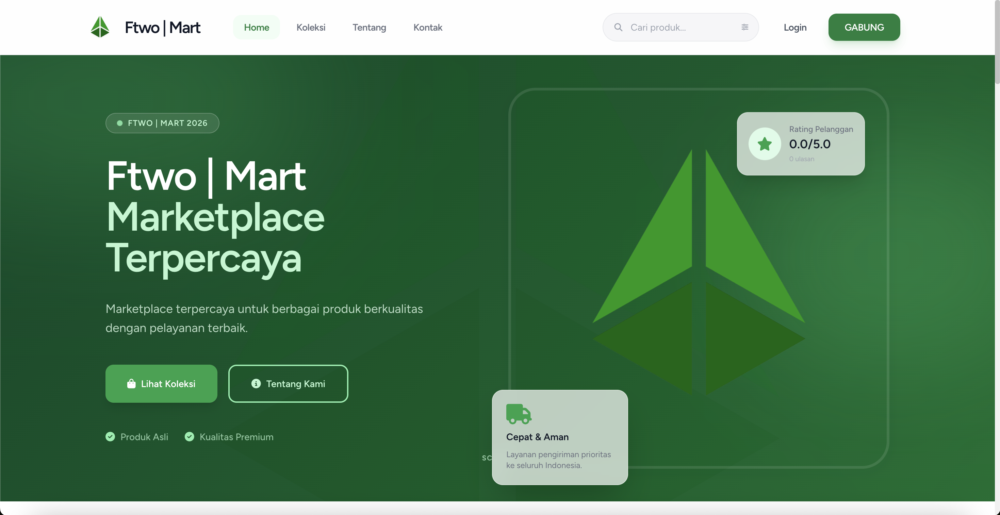
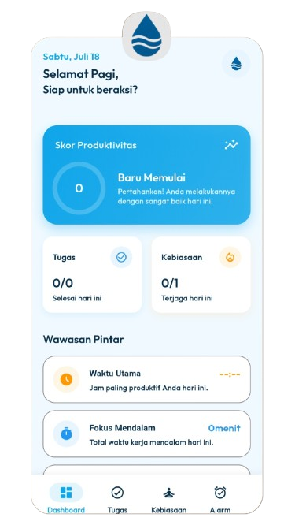
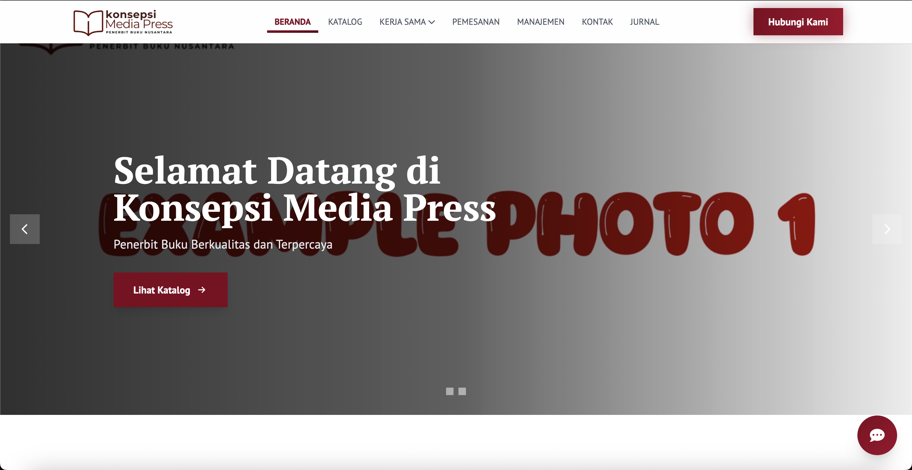
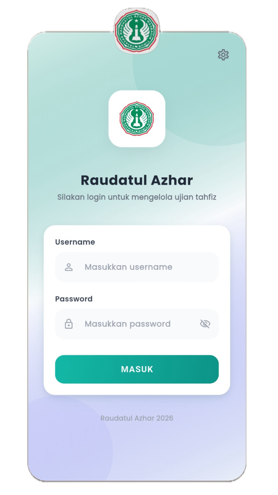

<div align="center">


<br>

<a href="https://git.io/typing-svg">


</a>

<br><br>


</div>

---

#  whoami

```bash
┌──(arman@ftwodev)-[~/profile]
└─$ ./whoami

Name        : Arman Wiranda

Role        : Lead Developer

Company     : FTwoDev

Location    : East Lombok, Indonesia

Profession  : Full Stack Developer

Focus       : Laravel | Next.js | Flutter

Interest    : Cyber Security
              Artificial Intelligence
              Machine Learning
              Chatbot

Mission     : Build digital products that solve
              real-world problems.
```

---

#  About Me

<table>

<tr>

<td width="60%">

### Hello There 👋

I'm **Arman Wiranda**, a **Full Stack Developer** based in **East Lombok, Indonesia**.

Currently serving as **Lead Developer at FTwoDev**, where I design and build scalable digital products ranging from company profiles, information systems, SaaS platforms, and mobile applications.

I enjoy creating clean architectures, modern UI, maintainable backend systems, and continuously exploring new technologies.

### Currently Exploring

- Artificial Intelligence
- Machine Learning
- AI Chatbot
- Cyber Security
- Cloud Computing

</td>

<td align="center">


</td>

</tr>

</table>

---

#  Technology Stack

<br>

<div align="center">

## Frontend


<br>


</div>

---

<div align="center">

## Styling


<br>


</div>

---

<div align="center">

## Backend


<br>


</div>

---

<div align="center">

## Mobile


<br>


</div>

---

<div align="center">

## Database


<br>


</div>

---

<div align="center">

## Tools


<br>


</div>

---

<div align="center">


</div>

#  Development Fields

<div align="center">

<table>

<tr>

<td width="50%" align="center">


<h3>Web Development</h3>

Modern, scalable and responsive web applications.

<br>


</td>

<td width="50%" align="center">


<h3>Mobile Development</h3>

Cross-platform mobile application development.

<br>


</td>

</tr>

<tr>

<td align="center">


<h3>Artificial Intelligence</h3>

Currently learning Machine Learning, AI Chatbot and Automation.

<br>


</td>

<td align="center">


<h3>Cyber Security</h3>

Learning secure development and web security fundamentals.

<br>


</td>

</tr>

</table>

</div>

---

#  GitHub Analytics

<div align="center">


</div>

> **Note:** GitHub Stats & Streak kadang tidak tampil karena layanan publiknya sedang mengalami gangguan. Activity Graph dan Snake biasanya lebih stabil.

---

#  Contribution Snake

<div align="center">


</div>

---

#  FTwoDev

<div align="center">


## Building Modern Digital Solutions

</div>

FTwoDev adalah startup software development yang saya pimpin sebagai **Lead Developer**.

Kami berfokus pada pengembangan solusi digital modern untuk bisnis, instansi, UMKM, maupun personal.

### Services

- 🌐 Company Profile Website
- 🛒 E-Commerce
- 📊 Information System
- 📱 Mobile Application
- ⚙️ Custom Web Application
- 🔗 REST API Development
- 🚀 SaaS Platform

---

---

#  Featured Projects

<div align="center">

> Some of the projects I've built as a Full Stack Developer.

</div>

<br>

<table>

<tr>

<td width="50%" valign="top">

<h2 align="center">🛒 FTWO Mart</h2>

<p align="center">

<b>Modern Multi-Product E-Commerce Platform</b>

</p>

<p align="center">

<a href="https://mart.ftwodev.id">


</a>

<a href="https://github.com/Randa23356/ftwo-mart">


</a>

</p>



### ✨ Features

- Multi-product marketplace
- Midtrans Payment Gateway
- QRIS & E-Wallet
- Real-time Order Tracking
- Dashboard Analytics
- Dynamic CMS
- PDF Invoice
- Multi Role Authentication

### ⚙️ Tech Stack


</td>

<td width="50%" valign="top">

<h2 align="center">📱 DailyFlow</h2>

<p align="center">

<b>Offline First Productivity App</b>

</p>

<p align="center">

<a href="https://github.com/Randa23356/DailyFlow">


</a>

</p>



### ✨ Features

- Todo Manager
- Habit Tracker
- Smart Reminder
- Offline First
- Material 3
- Dark Mode
- Riverpod
- Clean Architecture

### ⚙️ Tech Stack


</td>

</tr>

<tr>

<td width="50%" valign="top">

<h2 align="center">💻 AlphaTech</h2>

<p align="center">

<b>Modern Informatics Collaboration Platform</b>

</p>

<p align="center">

<a href="https://alpha-tech.ftwodev.id">


</a>

<a href="#">


</a>

</p>


### ✨ Features

- Google OAuth
- Dynamic CMS
- Documentation Platform
- Gallery
- FCM Notification
- Responsive UI
- Admin Dashboard
- Announcement System

### ⚙️ Tech Stack


</td>

<td width="50%" valign="top">

<h2 align="center">📚 Konsepsi Media Press</h2>

<p align="center">

<b>Professional Publishing Platform</b>

</p>

<p align="center">

<a href="#">


</a>

</p>



### ✨ Features

- Book Catalog
- Publishing Order
- Dynamic CMS
- Admin Dashboard
- Contact System
- Responsive Layout
- Search Book
- Slider Management

### ⚙️ Tech Stack


</td>

</tr>

</table>

<br>

<div align="center">

<table>

<tr>

<td width="70%" valign="top">

<h2 align="center">🎓 Al Azhar Learning Management System</h2>

<p align="center">

<b>Learning Management System for Schools</b>

</p>

<p align="center">

<a href="#">


</a>

</p>



### ✨ Features

- Multi Role Authentication
- Learning Materials
- Assignment & Quiz
- Student Dashboard
- Teacher Dashboard
- Operator Dashboard
- Admin Dashboard
- Statistics & Reports

### ⚙️ Tech Stack


</td>

</tr>

</table>

</div>

---

<div align="center">


</div>

#  Developer Philosophy

```

while(alive){

    Learn();

    Build();

    Improve();

    Repeat();

}

```

---

#  Developer Profile

```yaml
Name: Arman Wiranda

Role: Lead Developer

Company: FTwoDev

Location: East Lombok, Indonesia

Frontend:
  - Next.js
  - React.js
  - JavaScript

Backend:
  - Laravel
  - Native PHP

Mobile:
  - Flutter
  - Apache Cordova

Database:
  - MySQL
  - SQLite

Styling:
  - Tailwind CSS
  - Bootstrap

Tools:
  - Git
  - VS Code
  - Laragon
  - XAMPP
  - Figma
  - Stitch AI

Learning:
  - Machine Learning
  - AI Chatbot
  - Cyber Security
```

---

<div align="center">


</div>

#  Connect With Me
<div align="center">

## Let's Build Something Amazing Together 🚀

If you have an interesting project, startup idea, or collaboration opportunity,
feel free to reach out.

<br>

<a href="mailto:wrnda1823@gmail.com">


</a>

<a href="https://github.com/Randa23356">


</a>

</div>

---

#  Current Development Roadmap

```text
🛒 FTWO Mart
████████████████████░ 95%

💻 AlphaTech
███████████████████░░ 90%

📱 DailyFlow
██████████████░░░░░░░ 70%

📚 Konsepsi Media Press
█████████████████████ 100%

🎓 Al Azhar LMS
█████████████████████ 100%
```

<div align="center">

**Always improving, optimizing, and building better software. 🚀**

</div>

---

#  Tech Highlights

<div align="center">


</div>

<br>

<div align="center">


</div>

---

#  Developer Mindset

```text
Think First.

Design Clean.

Write Maintainable Code.

Build Scalable Systems.

Never Stop Learning.
```

---

#  FTwoDev

<div align="center">

## FTwoDev

Building Software That Matters.

</div>

We believe technology should solve real-world problems.

Our focus:

- Modern Web Development
- Mobile Applications
- Business Information Systems
- Custom Software
- SaaS Development
- REST API Integration

---

#  My Workflow

```text
Idea
 │
 ▼
Research
 │
 ▼
UI / UX Design
 │
 ▼
Development
 │
 ▼
Testing
 │
 ▼
Deployment
 │
 ▼
Maintenance
```

---

#  Favorite Tech

<div align="center">


</div>

---

#  Connect With Me

<div align="center">

<a href="https://github.com/Randa23356">


</a>

&nbsp;&nbsp;&nbsp;

<a href="mailto:wrnda1823@gmail.com">


</a>

</div>

<br>

<div align="center">


</div>

---

<div align="center">

## 💙 Thanks for visiting my profile!


<br>

*"Building technology is not just writing code, it's creating solutions that make people's lives easier."*

<br><br>


</div>
